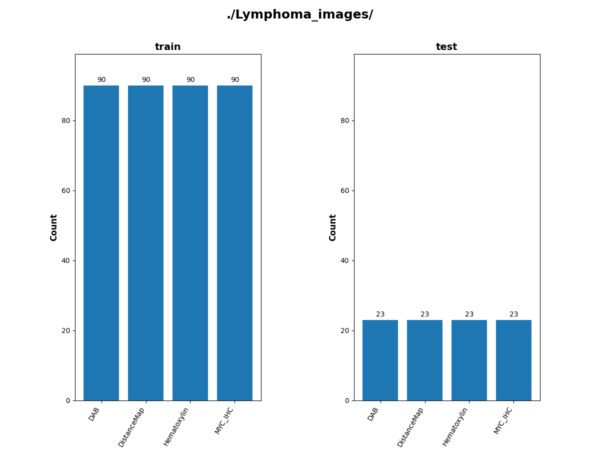
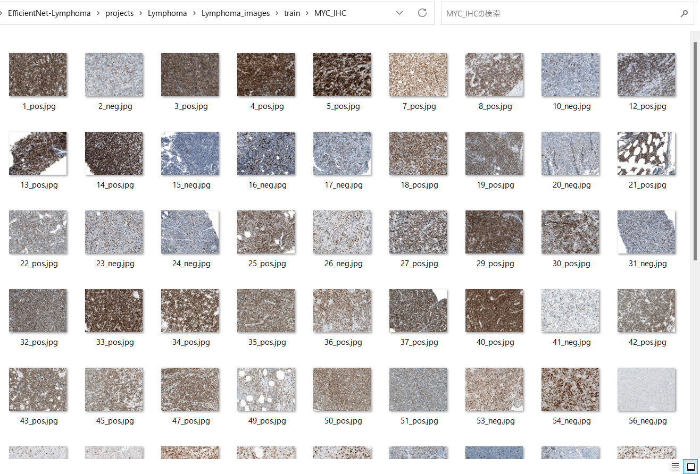

<h2>EfficientNet-Lymphoma (Updated: 2023/03/28)</h2>
<a href="#1">1 EfficientNetV2 EfficientNet-Lymphoma Classification </a> 
<a href="#1.1">1.1 Clone repository</a> 
<a href="#1.2">1.2 Prepare Peripheral Blood Cell dataset</a> 
<a href="#1.3">1.3 Install Python packages</a> 
<a href="#2">2 Python classes for Peripheral Blood Cell Classification</a> 
<a href="#3">3 Pretrained model</a> 
<a href="#4">4 Train</a> 
<a href="#4.1">4.1 Train script</a> 
<a href="#4.2">4.2 Training result</a> 
<a href="#5">5 Inference</a> 
<a href="#5.1">5.1 Inference script</a> 
<a href="#5.2">5.2 Sample test images</a> 
<a href="#5.3">5.3 Inference result</a> 
<a href="#6">6 Evaluation</a> 
<a href="#6.1">6.1 Evaluation script</a> 
<a href="#6.2">6.2 Evaluation result</a> 

<h2>
<a id="1">1 EfficientNetV2 Lymphoma Classification</a>
</h2>

 This is an experimental Lymphoma Image Classification project based on <b>efficientnetv2</b> in <a href="https://github.com/google/automl">Brain AutoML</a>.
 

The orignal Lymphoma image dataset used here has been taken from the following web site:
<pre>
Dataset: https://bit.ly/2MdWSzp

Citation:
https://www.ncbi.nlm.nih.gov/pubmed/27093450
https://arxiv.org/abs/1409.1556
https://arxiv.org/abs/1905.11946
</pre>

 
 We use python 3.8 and tensorflow 2.8.0 environment on Windows 11. 
<h3>
<a id="1.1">1.1 Clone repository</a>
</h3>
 Please run the following command in your working directory: 
<pre>
git clone https://github.com/EfficientNet-Lymphoma.git
</pre>
You will have the following directory tree: 
<pre>
.
├─asset
└─projects
    └─Lymphoma
        ├─eval
        ├─evaluation
        ├─inference        
        └─test
</pre>
<h3>
<a id="1.2">1.2 Lymphoma dataset</a>
</h3>

Please download the dataset <b>Picture</b> from the following web site:
 
Dataset: https://bit.ly/2MdWSzp 

 
The original dataset contains the following 4 types of images: 
<pre>
DAB(MYC signal)
Distance map of positive nuclei
Hematoxylin (blue counterstrain)
MYC IHC
</pre>
For simplicity, we use the following names instead of 4 types name above: 
<pre>
DAB
DistanceMap
Hematoxylin
MYC_IHC
</pre>
 
1 We have created <b>Lymphoma_images_master</b> dataset from
the orignal image dataset <b>Pictures</b> by using 
<a href="./projects/Lymphoma/create_master.py">create_master.py</a> script, by which
we have converted the original tif files to jpg files of size 1/5.

<pre>
>python create_master.py
</pre> 

2 Furthermore, we have created <b>Lymphoma_images</b> dataset from the <b>Lymphoma_images_master</b> 
by using <a href="./projects/Lymphoma/split_master.py">split_master.py </a> script, 
by which we have splitted the master dataset to train and test dataset.

<pre>
>python split_master.py
</pre> 

<pre>
.
├─asset
├─efficientnetv2-m
└─projects
    └─Lymphoma
        ├─Lymphoma_images
        │  ├─test
        │  │  ├─DAB
        │  │  ├─DistanceMap
        │  │  ├─Hematoxylin
        │  │  └─MYC_IHC
        │  └─train
        │      ├─DAB
        │      ├─DistanceMap
        │      ├─Hematoxylin
        │      └─MYC_IHC
        ├─eval
        ├─evaluation
        ├─inference
        ├─models
        └─test
　...
</pre>

 

The numbe of images of this dataset is the following. 

 

Sample images of Lymphoma_images/train/DAB: 

  

Sample images of Lymphoma_images/train/DistanceMap: 

  

Sample images of Lymphoma_images/train/Hematoxylin: 

  

Sample images of Lymphoma_images/train/MYC_IHC: 

  

 

<h3>
<a id="#1.3">1.3 Install Python packages</a>
</h3>
Please run the following commnad to install Python packages for this project. 
<pre>
pip install -r requirements.txt
</pre>
 

<h2>
<a id="2">2 Python classes for Lymphoma Classification</a>
</h2>
We have defined the following python classes to implement our LymphomaClassification. 
<li>
<a href="./ClassificationReportWriter.py">ClassificationReportWriter</a>
</li>
<li>
<a href="./ConfusionMatrix.py">ConfusionMatrix</a>
</li>
<li>
<a href="./CustomDataset.py">CustomDataset</a>
</li>
<li>
<a href="./EpochChangeCallback.py">EpochChangeCallback</a>
</li>
<li>
<a href="./EfficientNetV2Evaluator.py">EfficientNetV2Evaluator</a>
</li>
<li>
<a href="./EfficientNetV2Inferencer.py">EfficientNetV2Inferencer</a>
</li>
<li>
<a href="./EfficientNetV2ModelTrainer.py">EfficientNetV2ModelTrainer</a>
</li>
<li>
<a href="./FineTuningModel.py">FineTuningModel</a>
</li>

<li>
<a href="./TestDataset.py">TestDataset</a>
</li>

<h2>
<a id="3">3 Pretrained model</a>
</h2>
 We have used pretrained <b>efficientnetv2-m</b> to train LymphomaModel.
Please download the pretrained checkpoint file 
from <a href="https://storage.googleapis.com/cloud-tpu-checkpoints/efficientnet/v2/efficientnetv2-m.tgz">efficientnetv2-m.tgz</a>, expand it, and place the model under our top repository.

<pre>
.
├─asset
├─efficientnetv2-m
└─projects
        ├─Lymphoma
  ...
</pre>

<h2>
<a id="4">4 Train</a>

</h2>
<h3>
<a id="4.1">4.1 Train script</a>
</h3>
Please run the following bat file to train our Lymphoma efficientnetv2 model by using
<b>Lymphoma Images/train</b>.
<pre>
./1_train.bat
</pre>
<pre>
rem 1_train.bat
python ../../EfficientNetV2ModelTrainer.py ^
  --model_dir=./models ^
  --eval_dir=./eval ^
  --model_name=efficientnetv2-m ^
  --data_generator_config=./data_generator.config ^
  --ckpt_dir=../../efficientnetv2-m/model ^
  --optimizer=rmsprop ^
  --image_size=360 ^
  --eval_image_size=360 ^
  --data_dir=./Lymphoma_images/train ^
  --data_augmentation=True ^
  --fine_tuning=True ^
  --monitor=val_loss ^
  --learning_rate=0.001 ^
  --trainable_layers_ratio=0.4 ^
  --dropout_rate=0.4 ^
  --num_epochs=100 ^
  --batch_size=4 ^
  --patience=10 ^
  --debug=True  
</pre>
, where data_generator.config is the following: 
<pre>
; data_generation.config

[training]
validation_split   = 0.2
featurewise_center = False
samplewise_center  = False
featurewise_std_normalization=False
samplewise_std_normalization =False
zca_whitening                =False
rotation_range     = 10
horizontal_flip    = True
vertical_flip      = True
width_shift_range  = 0.1
height_shift_range = 0.1
shear_range        = 0.01
zoom_range         = [0.2, 2.0]
channel_shift_range= 10
brightness_range   = [80,100]
data_format        = "channels_last"

</pre>

<h3>
<a id="4.2">4.2 Training result</a>
</h3>

This will generate a <b>best_model.h5</b> in the models folder specified by --model_dir parameter. 
Furthermore, it will generate a <a href="./projects/Lymphoma/eval/train_accuracies.csv">train_accuracies</a>
and <a href="./projects/Lymphoma/eval/train_losses.csv">train_losses</a> files
 
Training console output: 
 
 
Train_accuracies: 
 

 
Train_losses: 
 

 
<h2>
<a id="5">5 Inference</a>
</h2>
<h3>
<a id="5.1">5.1 Inference script</a>
</h3>
Please run the following bat file to infer the skin cancer lesions in test images by the model generated by the above train command. 
<pre>
./2_inference.bat
</pre>
<pre>
rem 2_inference.bat
python ../../EfficientNetV2Inferencer.py ^
  --model_name=efficientnetv2-m  ^
  --model_dir=./models ^
  --fine_tuning=True ^
  --trainable_layers_ratio=0.4 ^
  --dropout_rate=0.5 ^
  --image_path=./test/*.jpg ^
  --eval_image_size=360 ^
  --label_map=./label_map.txt ^
  --mixed_precision=True ^
  --infer_dir=./inference ^
  --debug=False 
</pre>
 
label_map.txt:
<pre>
DAB
DistanceMap
Hematoxylin
MYC_IHC
</pre>
 
<h3>
<a id="5.2">5.2 Sample test images</a>
</h3>

Sample test images generated by <a href="./projects/Lymphoma/create_test_dataset.py">create_test_dataset.py</a> 
from <a href="./projects/Lymphoma/Lymphoma/test">Lymphoma/test</a>.
 
 

 
<h3>
<a id="5.3">5.3 Inference result</a>
</h3>
This inference command will generate <a href="./projects/Lymphoma/inference/inference.csv">inference result file</a>.
 At this time, you can see the inference accuracy for the test dataset by our trained model is very low.
More experiments will be needed to improve accuracy. 

 
Inference console output: 
 
 

Inference result (<a href="./projects/Lymphoma/inference/inference.csv">inference.csv</a>): 
 
 
<h2>
<a id="6">6 Evaluation</a>
</h2>
<h3>
<a id="6.1">6.1 Evaluation script</a>
</h3>
Please run the following bat file to evaluate <a href="./projects/Lymphoma/Lymphoma/test">
Lymphoma_images/test</a> by the trained model. 
<pre>
./3_evaluate.bat
</pre>
<pre>
rem 3_evaluate.bat
python ../../EfficientNetV2Evaluator.py ^
  --model_name=efficientnetv2-m  ^
  --model_dir=./models ^
  --data_dir=./Lymphoma_images/test ^
  --evaluation_dir=./evaluation ^
  --fine_tuning=True ^
  --trainable_layers_ratio=0.4 ^
  --dropout_rate=0.5 ^
  --eval_image_size=360 ^
  --mixed_precision=True ^
  --debug=False 
</pre>
 

<h3>
<a id="6.2">6.2 Evaluation result</a>
</h3>

This evaluation command will generate <a href="./projects/Lymphoma/evaluation/classification_report.csv">a classification report</a>
 and <a href="./projects/Lymphoma/evaluation/confusion_matrix.png">a confusion_matrix</a>.
 
 
Evaluation console output: 
 
 

 
Classification report: 
 
 
Confusion matrix: 
 

 
<h3>
References
</h3>
<b>1. Lyephoma image </b> 
<pre>
The orignal Lyephoma image dataset used here has been taken from the following web site:
Dataset: https://bit.ly/2MdWSzp

</pre>

<b>2.Predicting-Lymphoma-using-CNN-in-Keras</b> 
Sandip Saha Joy 
<pre>
https://github.com/sandipsahajoy/Predicting-Lymphoma-using-CNN-in-Keras
</pre>
<b>3. Deep Learning for Lymphoma Detection on Microscopic Images</b> 
<pre>
https://www.atlantis-press.com/article/125979336.pdf
</pre>

<b>4. Deep Learning for the Classification of Non-Hodgkin Lymphoma on Histopathological Images</b> 
Georg Steinbuss,Mark Kriegsmann,Christiane Zgorzelski, Alexander Brobeil, Benjamin Goeppert, 
Sascha Dietrich, Gunhild Mechtersheimer, and Katharina Kriegsmann1 
<pre>
https://www.ncbi.nlm.nih.gov/pmc/articles/PMC8156071/
</pre>

